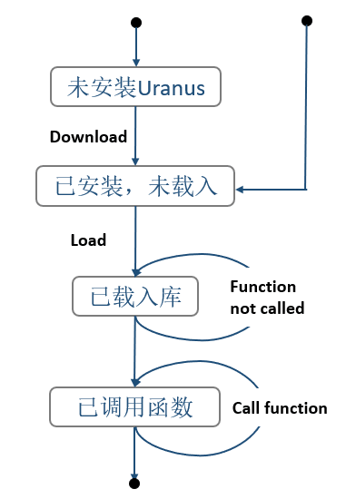

# 软件工程大作业

## To-do List

该数学库优先能够正常使用并解决模式识别(AI5278L)的课程的大作业。随着最优化(AI5276L)课程，更多算法会逐步添加进来。

## To-do Use
- 代码构建：https://cmake.org/
- 线性代数：http://eigen.tuxfamily.org/index.php?title=Main_Page
- 文档生成：http://www.doxygen.org/
- 日志系统：https://github.com/google/glog
- 数据存储：https://developers.google.com/protocol-buffers/
- 单元测试：https://github.com/google/googletest.git
- 集成测试：https://travis-ci.org/

## Some Pic
以下仅仅是项目需求分析，与项目具体内容代码关联不大。

---

---

---

---

---

